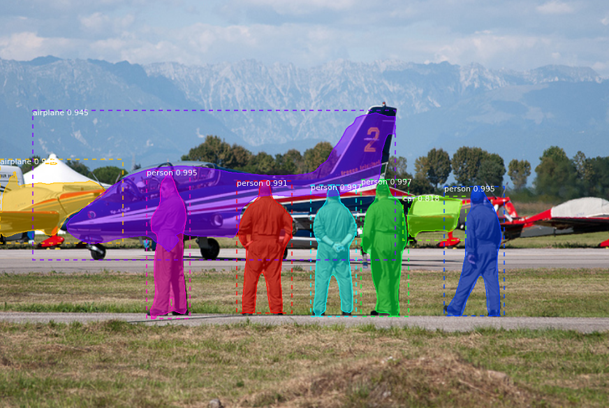

# Object-segmentation-using-Mask-RCNN
This is a simple implementation of Mask RCNN on Python 3, Keras and Tensorflow version 2. The model generates the bounding box and the segmentation mask for the input images with their coresponding confidence score. This code is forked from the official implementation of Mask RCNN by [matterport](https://github.com/matterport/Mask_RCNN)

## Requirements
### Installation
`pip3 install -r requirements.txt`

### Weight file
Download the weight file from the below link and save it in the same directory
[mask_rcnn_coco.h5](https://github.com/matterport/Mask_RCNN/releases/download/v1.0/mask_rcnn_coco.h5)

## Run
Use the jupyter notebook [test.ipynb](https://github.com/Aasish4/Object-segmentation-using-Mask-RCNN/blob/main/Test.ipynb) for testing the mask rcnn.

## Output
Sample output of Mask RCNN (object detection and segmentation)

